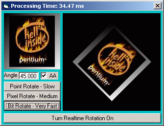



## Very Fast Rotate Picture with Anti\-Alias

### Description

You Gotta Check This Out! Rotate a picture any angle -359.999° to 359.999° with or without Anti-Alias effect. I have coded it 3 different ways to show you the advantages and disadvantages of various graphics routines. First example rotates from 1 picture to another using Point and Pset. The second one uses GetPixel and SetPixel APIs. The third, a very fast technique using GetDiBits and SetDiBits (The fastest way to rotate a picture using API). Also includes my CodeTimer class which is useful for benchmarking your code. It is returns values in milliseconds accurate to 2 decimal places (10 nanoseconds). I have put in TONS of comments and optimized the code to its fullest potential. It is even possible to rotate a picture in realtime! Update - Point/Pset and GetPixel/SetPixel are now even faster.
 
### More Info
 

             |
---                |---
**Submitted On**   |2002-08-03 09:30:32
**By**             |[¿?¿?](https://github.com/Planet-Source-Code/PSCIndex/blob/master/ByAuthor/empty.md)
**Level**          |Intermediate
**User Rating**    |4.4 (128 globes from 29 users)
**Compatibility**  |VB 6\.0
**Category**       |[Graphics](https://github.com/Planet-Source-Code/PSCIndex/blob/master/ByCategory/graphics__1-46.md)
**World**          |[Visual Basic](https://github.com/Planet-Source-Code/PSCIndex/blob/master/ByWorld/visual-basic.md)
**Archive File**   |[Very\_Fast\_113939832002\.zip](https://github.com/Planet-Source-Code/very-fast-rotate-picture-with-anti-alias__1-37548/archive/master.zip)

